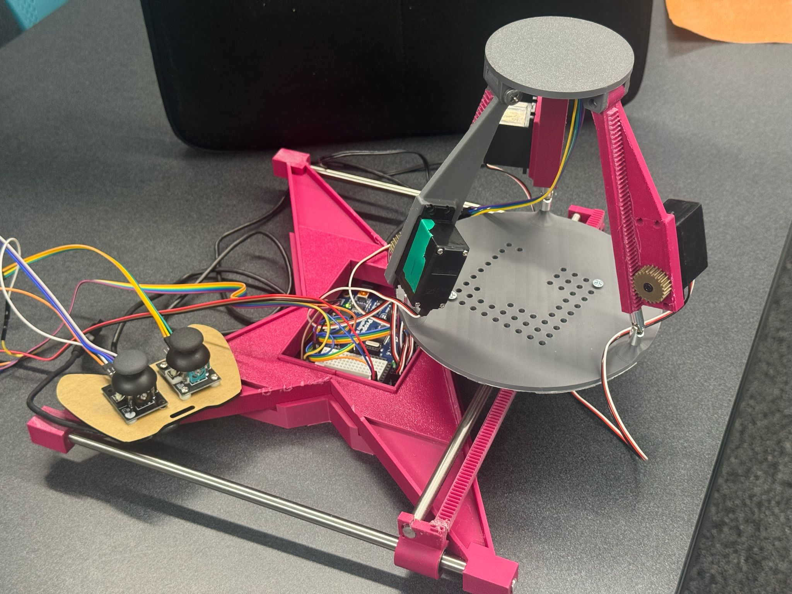

# ABOUT PROJECT

This project presents a custom-built 5-DOF rehabilitation platform that integrates a 3RPS (Revolute-Prismatic-Spherical) parallel mechanism with a 2D Cartesian gantry, designed to support balance and gait training for stroke recovery. Powered by the Parallax Propeller Activity Board, the system uses continuous servos for motion and dual joysticks for manual control.

As part of the development team, I led the IMU integration and sensor fusion pipeline, which provided real-time roll and pitch feedback critical for platform stabilisation. I implemented a custom imu_sensor.h library to interface with the MPU6050, developed a gyro calibration routine, and applied Kalman filtering principles to smooth noisy sensor data. These enhancements enabled reliable real-time feedback, significantly improving the responsiveness and safety of the system during live demos.

🔧 Key Contributions:

+Designed and implemented IMU communication and processing over I2C.

+Developed real-time roll/pitch estimation from raw gyro data.

+Enabled multi-cog feedback integration to adjust platform tilt dynamically.

+Supported safety interlocks based on tilt thresholds to prevent overextension.

+This system laid the groundwork for future developments like spline-based movement learning and SD card-driven motion playback, offering a scalable foundation for intelligent rehabilitation robotics.

